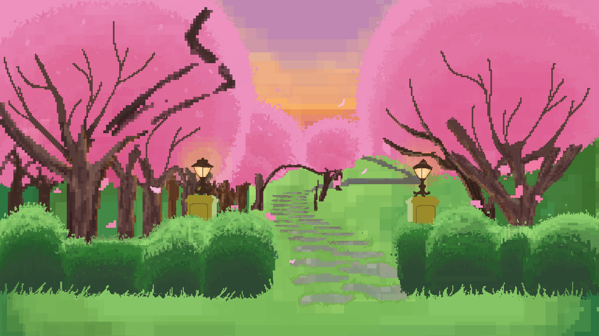

# 🎮 Quatrefoil - Game Build

Welcome to the playable build of **Quatrefoil**!

## 📥 Download & Play

👉 [Click here to download the game](https://github.com/FruitMix22/QuatreFoil/releases/tag/Game-V1.0_alpha)  
(*Windows only, no installation required*)

Once downloaded, just double-click the `Quatrefoil.exe` to play.

## ℹ️ About the Game

Quatrefoil is a fast-paced 2D action game developed in C++ using OpenGL.  
Enemies spawn in waves, you survive and fight them off — good luck.

## 🎮 Controls
A to move left
D to move right
Left Arrow to attack left
Right Arrow to attack right
To 'combo' attack left, then right to do a slash,
also can be alternated such as right to left.

## 🧪 Built With

- OpenGL (Custom Game Engine)
- C++
- ImGui (for debugging tools and overlays)

## 🚀 Want to See the Code?

If you're curious how the game works under the hood or want to modify it:

- 🔧 Game source code is within this branch.
- 🛠️ **[Game Engine](https://github.com/FruitMix22/QuatreFoil/tree/engine-main)** — reusable custom engine.

---
## 🎨 Credits

This game uses sprite assets from the following artists:

- **[Warrior-Free-Animation-Set](https://clembod.itch.io/warrior-free-animation-set)** — Public domain sprites used for UI elements and enemies.
- **[pixel-art-slime](https://diogo-vernier.itch.io/pixel-art-slime/devlog/708883/free-animated-pixel-art-slime)** — Public domain sprites used for UI elements and enemies.

Assets are used with permission for commercial use. Credit is not required by the authors but is given here out of appreciation.
